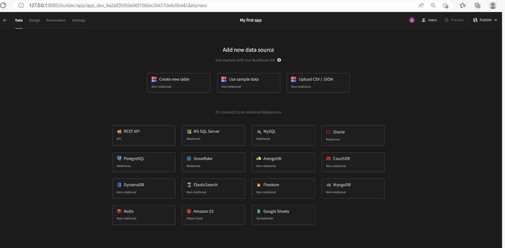
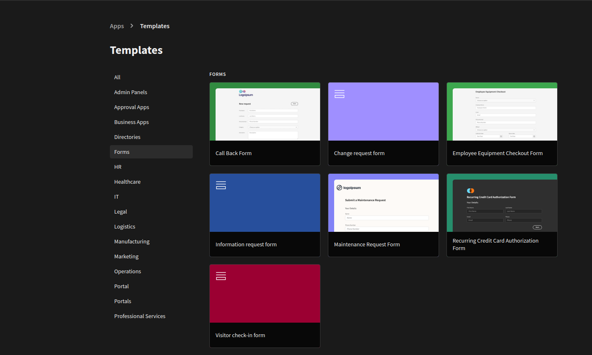

# Hướng dẫn sử dụng lowcode Budibase

Budibase là một nền tảng low-code all in one để giúp cho việc xây dựng, thiết kế và tự động hóa các ứng dụng kinh doanh, ví dụ như: admin panels, forms, internal tools, client portals, etc. Trước khi có Budibase, các nhà phát triển có thể mất hàng tuần để xây dựng các ứng dụng CRUD đơn giản; với Budibase, việc xây dựng các ứng dụng CRUD chỉ mất vài phút.

## vì sao lại sử dụng Budibase

Có nhiều công cụ và framework khác nhau để bạn xây dựng ứng dụng web. Tuy vậy Budibase là sự lựa chọn tốt nhất để xây dựng các ứng dụng kinh doanh hiện đại.

Đàu tiên opensource - Budibase hoàn toàn free, bạn có thể triển khai Budibase trên cơ sở hạ tầng của riêng bạn.
All-in-one platform - Không giống như các nền tảng khác, Budibase có cơ sở dữ liệu tích hợp, các nguồn dữ liệu bên ngoài, giao diện thiết kế GUI và phần tự động hóa - bạn có thể xây dựng một ứng dụng full-stack ngay trong Budibase mà không cần phải rời khỏi nền tảng!
Design - Ứng dụng Budibase trông rất đẹp ngay từ đầu. Chúng tôi đã dành nhiều thời gian và công sức để xây dựng các thành phần dễ tiếp cận, hiệu suất cao và đẹp mắt. Ngoài ra, không giống như các nền tảng khác, ứng dụng Budibase hoạt động hoàn hảo trên cả desktop và di động.
Real apps - Với Budibase, bạn có thể xây dựng các high-performing single-page applications, hiệu suất cao. Ứng dụng của bạn có thể là ứng dụng công khai, ứng dụng riêng tư, hoặc cả hai - và chúng cũng có thể chứa nhiều màn hình!


### Sử dụng budibase

Trong phần này chúng ta sẽ tập trung vào việc ứng dụng tạo một app có tên là MyApp với budibase

Trước tiên truy cập `http://localhost:8080`
Nếu bạn chưa chạy thì hay tạo budibase với docker

```
version: "3"

services:
  budibase:
    #restart: unless-stopped
    image: budibase/budibase:latest
    ports:
      - "8080:80"
    environment:
      JWT_SECRET: password
      #MINIO_ACCESS_KEY: <secret>
      #MINIO_SECRET_KEY: <secret>
      REDIS_PASSWORD: password
      COUCHDB_USER: username
      COUCHDB_PASSWORD: password
      INTERNAL_API_KEY: key
    volumes:
      - budibase_data:/data

volumes:
  budibase_data:
    driver: local
```

```
docker compose up -d
```

Phần tiếp theo sẽ cho phép chúng ta lựa chọn datasource để sử dụng. Budibase support các datasource rất đa dạng, từ những database popular nhất như sql, mongo cho tới local database từ chính budibase quản lý và các datasource từ api



Trong phần này chúng ta lựa chọn dùng local storage của budibase qua csv hay json data


Budibase cung cấp một tập các [template](https://github.com/Budibase/templates) để bạn có thể sử dụng như ví dụ mẫu

