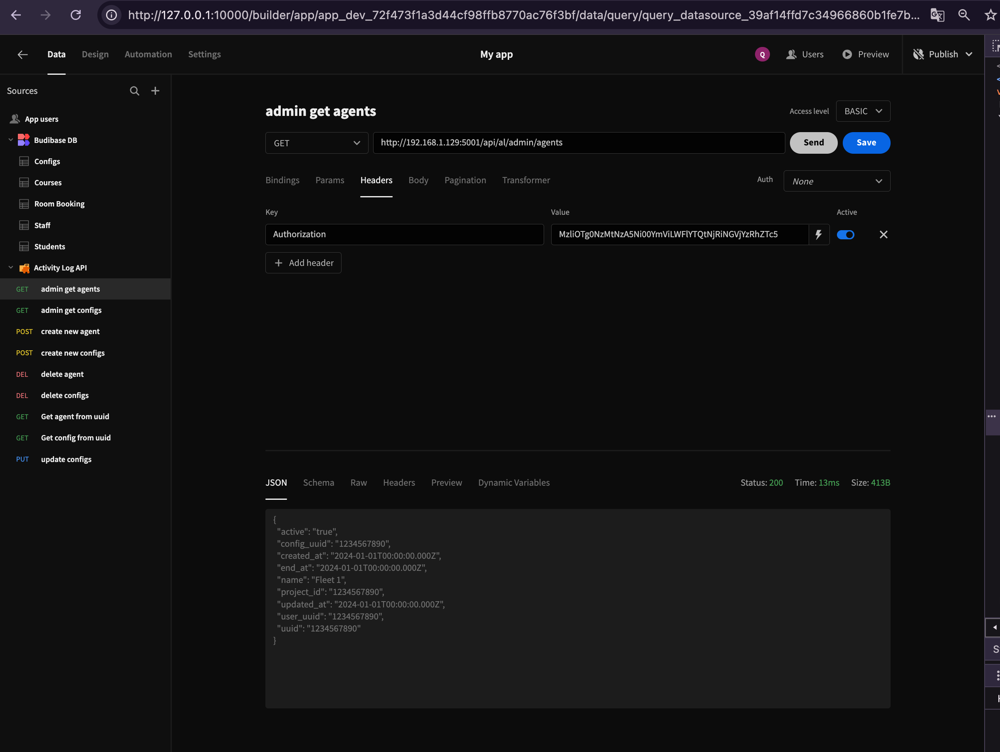

# Hướng dẫn sử dụng lowcode Budibase

Budibase là một nền tảng low-code all in one để giúp cho việc xây dựng, thiết kế và tự động hóa các ứng dụng kinh doanh, ví dụ như: admin panels, forms, internal tools, client portals, etc. Trước khi có Budibase, các nhà phát triển có thể mất hàng tuần để xây dựng các ứng dụng CRUD đơn giản; với Budibase, việc xây dựng các ứng dụng CRUD chỉ mất vài phút.

## vì sao lại sử dụng Budibase

Có nhiều công cụ và framework khác nhau để bạn xây dựng ứng dụng web. Tuy vậy Budibase là sự lựa chọn tốt nhất để xây dựng các ứng dụng kinh doanh hiện đại.

Đàu tiên opensource - Budibase hoàn toàn free, bạn có thể triển khai Budibase trên cơ sở hạ tầng của riêng bạn.
All-in-one platform - Không giống như các nền tảng khác, Budibase có cơ sở dữ liệu tích hợp, các nguồn dữ liệu bên ngoài, giao diện thiết kế GUI và phần tự động hóa - bạn có thể xây dựng một ứng dụng full-stack ngay trong Budibase mà không cần phải rời khỏi nền tảng!
Design - Ứng dụng Budibase trông rất đẹp ngay từ đầu. Chúng tôi đã dành nhiều thời gian và công sức để xây dựng các thành phần dễ tiếp cận, hiệu suất cao và đẹp mắt. Ngoài ra, không giống như các nền tảng khác, ứng dụng Budibase hoạt động hoàn hảo trên cả desktop và di động.
Real apps - Với Budibase, bạn có thể xây dựng các high-performing single-page applications, hiệu suất cao. Ứng dụng của bạn có thể là ứng dụng công khai, ứng dụng riêng tư, hoặc cả hai - và chúng cũng có thể chứa nhiều màn hình!


### Sử dụng budibase

Trong phần này chúng ta sẽ tập trung vào việc ứng dụng tạo một app có tên là MyApp với budibase

Trước tiên truy cập `http://localhost:8080`
Nếu bạn chưa chạy thì hay tạo budibase với docker

```
version: "3"

services:
  budibase:
    #restart: unless-stopped
    image: budibase/budibase:latest
    ports:
      - "8080:80"
    environment:
      JWT_SECRET: password
      #MINIO_ACCESS_KEY: <secret>
      #MINIO_SECRET_KEY: <secret>
      REDIS_PASSWORD: password
      COUCHDB_USER: username
      COUCHDB_PASSWORD: password
      INTERNAL_API_KEY: key
    volumes:
      - budibase_data:/data

volumes:
  budibase_data:
    driver: local
```

```
docker compose up -d
```

Phần tiếp theo sẽ cho phép chúng ta lựa chọn datasource để sử dụng. Budibase support các datasource rất đa dạng, từ những database popular nhất như sql, mongo cho tới local database từ chính budibase quản lý và các datasource từ api


Trong phần này chúng ta lựa chọn dùng local storage của budibase qua csv hay json data


Budibase cung cấp một tập các [template](https://github.com/Budibase/templates) để bạn có thể sử dụng như ví dụ mẫu


Trong ví dụ này chúng ta sẽ chọn template Admin Panels > Car Rental Admin Panel

chúng ta sẽ điểm qua 1 số thông tin, 

Mục data sẽ cung cấp cho chúng ta thông dữ liệu do Budibase quản lý và bạn có thể quản lý trực tiếp ngay trên budibase hoặc thông qua thao tác trên giao diện ở phần design bên cạnh 


Mục Design là điểm nhấn của Budibase, hệ thống cung cấp cho chúng ta công cụ tùy chỉnh low code phải nói là đáp ứng tiêu chí để bạn có thể implement dynamic site 

Từ những công cụ cho phép bạn design (nếu như bạn có tay nghê design và code frontend chỉnh sửa css) thì đó là một lợi thế


Nút Preview sẽ cho chúng ta được xem kết quả tích hợp với datasource đã chọn thực tế ngay trực tiếp mà ko cần phải publish trang web. Nhấn vào nút Create New bạn sẽ thấy việc chuyển màn sang phần tạo mới hoặc update


Điền thống tin vào và nhấn save hệ thống sẽ cập nhập vào database (tuỳ theo datasource mà bạn lựa chọn)

Tiếp theo chúng ta sẽ đi vào phân tích những tính năng liên quan tới việc tích hợp Datasource REST API vào App cũng những sử dụng các event click và Automation (mới) trong Budibase. Có thể nói đây là điểm mạnh mà Budibase hỗ trợ.

Import file rest_api_export_1728661453159.tar.gz `trong projects/rest_api_export_1728661453159.tar.gz`

Giao diện Database bạn sẽ thấy 


Màn Design 


Lúc này chưa có dữ liệu gì do chúng ta cần phải start app server lên, ở đây chúng ta sẽ sử dụng flask để start server có trong file `app.py`




Chuyển sang trang Design chúng ta sẽ thấy kết quả được fill vào


Tiếp sau đó nhìn vào màn hình phía bên phải chúng ta sẽ thấy các event click và datasouce lựa chọn


Xuống phía dưới chúng ta sẽ thấy các event click button, chúng ta có thể tạo ra các event click để thực hiện các công việc nhất định


Tuỳ theo sự kiện chúng ta tạo một chuỗi các event click để thực hiện công việc như mong muốn


Bên cạnh việc hỗ trợ khác tốt trong vấn đề design và fill datasource từ nhiều nguồn, thêm các tiện ích event click thì tính năng automation cũng là một điểm mạnh mà Budibase hỗ trợ, mặc dù không mạnh như n8n nhưng cũng đầy đủ tiện ích support như webhook, hỗ trợ bash, js. Trong trường hợp phưc tạp cần nhiều hỗ trợ plugin hơn thì budibase cho phép tích hợp với cả n8n ngày trực tiếp 


